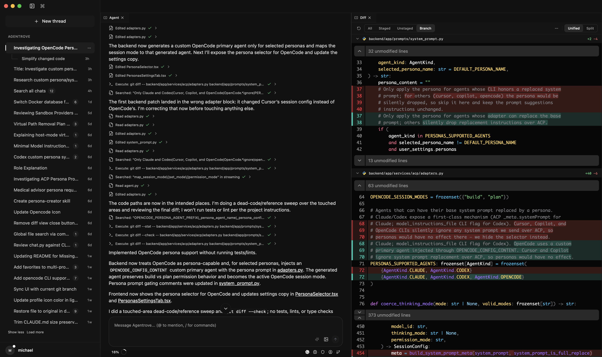

# Agentrove

Self-hosted AI coding workspace for running Claude Code, Codex, Copilot, Cursor, and OpenCode agents from one interface.

[](LICENSE)
[](https://www.python.org/)
[](https://react.dev/)
[](https://discord.gg/HvkJU8dcBA)

> Agentrove is under active development. Expect breaking changes between releases.



## What It Does

- Runs Claude, Codex, Copilot, Cursor, and OpenCode through ACP adapters.
- Gives each workspace its own Docker or host sandbox.
- Combines chat, code editor, terminal, file tree, diffs, secrets, and git tools in one workspace.
- Supports workspaces from empty folders, git clones, existing local folders, or GitHub repositories.
- Streams agent sessions with cancellation, permission prompts, queued follow-up messages, file mentions, slash commands, and attachments.
- Includes sub-threads, pinned chats, worktree mode, personas, custom instructions, environment variables, and installed agent skills.
- Provides GitHub-assisted repository browsing, pull request review, PR creation, reviewer selection, and git branch/commit/push/pull helpers.
- Ships as a Docker web app and a macOS desktop app.

## Quick Start

Requirements:

- Docker
- Docker Compose

```bash
git clone https://github.com/Mng-dev-ai/agentrove.git
cd agentrove
cp .env.example .env
```

Set `SECRET_KEY` in `.env`:

```bash
openssl rand -hex 32
```

Start Agentrove:

```bash
docker compose up -d
```

Open [http://localhost:3000](http://localhost:3000).

Useful commands:

```bash
docker compose logs -f
docker compose down
```

Default ports:

- Frontend: `3000`
- Backend API: `8080`
- Redis: `6379`

## Desktop

Agentrove also has a macOS desktop app built with Tauri. It starts a bundled Python backend sidecar on an available `127.0.0.1` port and connects the frontend to it at launch.

- Download the latest Apple Silicon build from [Releases](https://github.com/Mng-dev-ai/agentrove/releases/latest).
- Build from source:

```bash
cd frontend
npm install
npm run desktop:dev
```

## Production

For a single-host Docker deployment:

```bash
SECRET_KEY=$(openssl rand -hex 32) \
SERVICE_FQDN_WEB_80=https://yourdomain.com \
APP_URL=https://yourdomain.com \
ALLOWED_ORIGINS=https://yourdomain.com \
docker compose -f docker-compose-production.yml up -d --build
```

## Stack

- Frontend: React 19, TypeScript, Vite, Tailwind CSS, Monaco, xterm.js
- Backend: FastAPI, SQLAlchemy, SQLite, Redis
- Runtime: ACP, Docker or host sandboxes, Tauri desktop sidecar

## Community

Join the [Discord server](https://discord.gg/HvkJU8dcBA).

## License

Apache 2.0. See [LICENSE](LICENSE).
